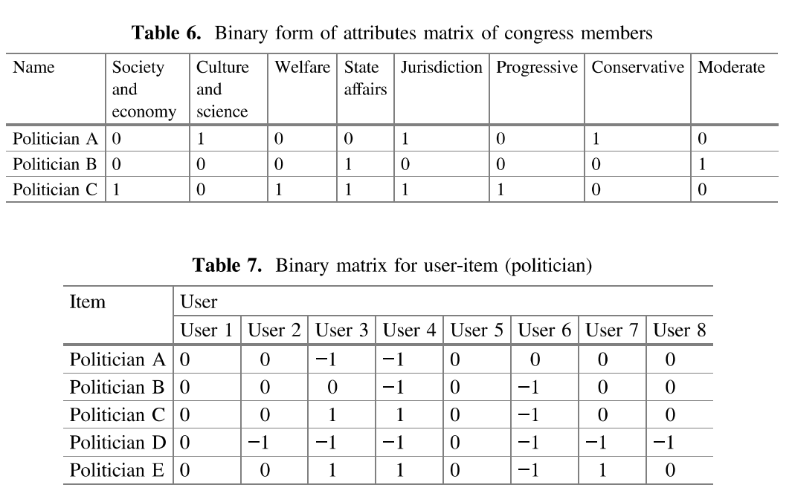

# Artigos

Para auxiliar o desenvolvimento do trabalho, procurou-se por artigos relacionados à recomendação e análise de candidatos à orgãos públicos.

## A Recommender System for Political Information Filtering

**Autores** : Kevin Lim, Chunghwan Kim, Gangsan Kim e Hyebong Choi

**Local** : *Design, User Experience and Usability*

**Ano** : 2017

A proposta do artigo é apresentar um sistema de recomendação de políticos da Coréia do Sul. Para realizar a coleta de dados/informações, eles relizaram uma pesquisa online com vários usuários onde os políticos podiam ser classificados entre 1 à 5, gerando uma tabela após realizar um *data cleaning*. Para o próximo passo, utilizando *web scraping* minerou-se dados públicos de políticos de sites que monitoram atividades legislativas, e assim foi decidido fazer a recomendação de políticos baseada nos seus atributos divididos em cinco categorias: *Political Career*, *Stading Commitee*, *Political Orientation*, *Specialization* e *Military Service*.

O sistema desenvolvido pelos pesquisadores utiliza tanto a filtragem colaborativa quanto a filtragem baseada em conteúdo, assim utilizando uma filtragem híbrida. Porém antes de desenvolverem o sistema de recomendação, eles realizaram um pré-processamento nos *datasets* obtidos.

Inicialmente, eles utilizaram seus *datasets* iniciais e escalonaram de forma que seja feita duas matrizes binárias, uma em relação a posição dos políticos para diversos atributos, e outra para afinidade de usuários para determinado político.

Dessa forma, pode-se obter o perfil do usuário baseada na preferência do usuário por tal políticio e seus atributos. Além desses *datasets* desenvolveu-se tuplas de três colunas: Usuário, Político e *Rating* (Avaliação).

Como dito antes, será construído dois tipos de sistema de recomendação, uma abordagem utiliza filtragem colaborativa com a ferramenta *recommenderlab* e outra utiliza filtragem baseada em conteúdo com a linguagem R.

Para construir este modelo, utilizou-se de técnicas de aprendizagem de máquina: dividiu o *dataset* em treinamento e teste, após análises eles concluíram em dividí-lo em 80% randomicamente. Em seguida, realizou-se a comparação entre a correlação de *Pearson* e similaridade cosseno para decidir qual método utilizar. Para validar o modelo gerado, utilizou-se *F-measure*, *RMSE*  e *MAE* (*Mean Absolute Error*).

### Considerações Finais, Opinião e Comparações

Analisando todo o procedimento efetuado e o resultado encontrado pela equipe, chega-se a conclusão que o projeto não foi desenvolvido apenas para recomendar candidatos ao público coreano, e sim verificar qual a melhor abordagem para desenvolver um sistema de recomendação otimizado, de forma que o resultado final dos modelos desenvolvidos não é apenas a apresentação de uma lista de candidatos, e sim verificar a perfomance de recomendação do modelo com base no *dataset* (justamtente por isos utilizou-se uma abordagem *Holdout*). Eles chegaram a conclusão que recomendar items com base no perfil do usuário e suas preferências aumenta a perfomance do sistema de recomendação.

Embora o tema do sistema de recomendação seja o mesmo do Projeto **EmQuemVotar**, a abordagem utilizada pela equipe é um pouco distinta além dos objetivos do projeto serem diferentes. Porém acredita-se que vale a pena analisar alguns pontos utilizados: 

* A equipe se deparou com o *cold start problem* e resolvou através de *data cleaning*, existe a possibilidade de este problema também acontecer
* Chegou-se a conclusão de utilizar a recomendação de items baseado no perfil do usuário, o projeto a ser desenvolvido utilizará esta mesma abordagem, portanto seria viável analisar a forma que fizeram a coleta de dados
* Para realizar a recomendação, é importante que os dados estejam definidos de uma forma correta, portanto quando estiver sendo desenvolvido o *dataset*, seria importante analisar o pré-processamento efetuado pela equipe